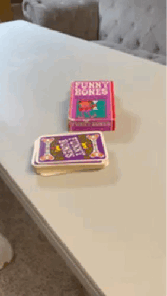

Without further ado, our first game is __Funny Bones__. 

<model-viewer class="model-viewer" src="./Funny-Bones.glb" ios-src="./Funny-Bones.usdz" poster="./funny-bones.png" alt="Funny Bones 3D Model scan" camera-controls ar loading="eager"></model-viewer>

As you can see the box is in decent condition.  It has some torn edges, random tape, and a few rips here and there.  Really, not too bad for a game from 1968.

In the box we have just a deck of large cards.  That's it.  No instructions included, with just a light bit of explainer text on the back of the box.  That's okay, each card has a point value on it, and we can make our own house rules and judgements as needed.  That's part of the fun, thrill, hunt, and challenge of thrift store gaming.  You don't get it all, all the time, but the price and the exploration generally make the gamble worth it.

<model-viewer class="model-viewer" src="./funny-bones-on-table.glb" ios-src="./funny-bones-on-table.usdz" poster="./funny-bones.png" alt="Funny Bones 3D Model scan" camera-controls ar loading="eager" ar-placement="wall"></model-viewer>

__But is it fun?__
Yes, yes it is.

We've played this with kids and at family functions with a mixed group of kids and adults.  Clearly by the artwork the expectation is that you'd play this game at a 60s adult dinner party.  While I think that could be fun, it may be a bit awkward to play this with any that isn't your direct spouse / significant other.  But hey, maybe playing this game would be a great way to meet said spouse or significant other if you are single?

We've generally house ruled that there is a 3rd person that is handing the next card off the deck to the 2 players playing.  This allows them to focus a bit more of keeping cards held between all the random connected body parts, giving them a chance to score a bit higher than if they had to move and bend to pickup another card from the deck themselves.

    

__Would I buy again?__
100%.  It's provided a few hours of entertainment, and for the purchase price of a few dollars (I don't recall the exact price, as I got this several years ago at a thrift store, but definitely under $5), it is an easy win.

Enjoy!

### Links

[Board Game Geek](https://boardgamegeek.com/boardgame/4509/funny-bones)  |  [eBay](https://www.ebay.com/sch/i.html?_nkw=funny+bones+card+game&_sacat=0&_from=R40&_trksid=p4432023.m570.l1311)  |  [Amazon](https://www.amazon.com/Parker-Brothers-Funny-Bones-People/dp/B000SJ5WL0)

