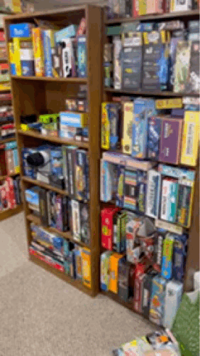

Howdy folks, my name is Justin and I like board games.  Buying board games at thrift stores, is a 2-for-1 hobby of mine.  Playing the board games is great and all, but I just might like the thrill of the hunt of buying another board game from a thrift store for a deal even better.  I have too many games and not enough plays.  So what shall we do?  

This blog is a personal effort to start playing more of those board games regularly, and sharing my thoughts as well.  Why start a written blog?  Well, I listen to the occasional podcast about board games, but I very much struggle watching video reviews.  Too long, didn't watch I guess.  I do, however, like the text reviews on BGG, so this will be in that vein.  I'll likely also post these reviews there as well. 

Adding to the plain text, as I realize that will be a hair boring, is 3D scanning via Apple's Reality Composer.  It seems that can be a fun way to show the exact game I have, and it's state as bought, as some of the boxes can be beat up, torn, etc as you might imagine from the thrift store.

Finally, in addition to the text and 3D scans, animated gifs are another nice way to balance that need to see components in action, but not needing to be a full video, so you'll see those too.  

Recap: Board games, thrift store, 3D scans, and animated gifs.  That is what you can expect, I hope you enjoy!

Without further ado, welcome to __Games We Have Played__. 

    

Here is the basement game room collection in all it's glory.  This is about the most organized it has been in quite a while.  Enjoy the (mostly) lack of games on the floor and generally shelved.

Follow along as I share my adventures on getting games to the table, scanning them in 3D, animating some gifs and writing some light reviews. 

Enjoy!

