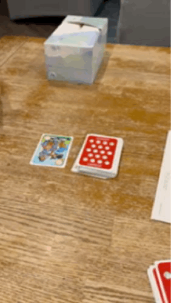

Another very simple, kids card game,  __Play Ball__ by Gamewright released in 1999.

<model-viewer class="model-viewer" src="./play-ball-gamewright.glb" ios-src="./play-ball-gamewright.usdz" poster="./play-ball-poster.jpg" alt="Play Ball 3D Model scan" camera-controls ar loading="eager"></model-viewer>

Based on the sharpie on the box, looks like it was listed for $1 at the thrift store, and that one that likes to mark on the boxes with sharpie, usually has 50% board games.  We have had this for a long while, but I'd bet I actually picked this up for $0.50.  You take the good (prices), with the bad (sharpie marks).  

In the box you have a deck 55 playing card size cards and the instructions.  There are 42 team cards (think suits), 7 wild cards, and 6 action cards; 2 each of Time Out, Pinch Hitter, and Yer Out! cards.  

The game lays out 3 different games that can be played with the same deck: Field of Teams, Hard Ball Nine, and Nine on the Field.  Hard Ball Nine and Nine on the Field are matching games and light adding games for very young kids, so we have never actually played those variants. 

    

The Field of Teams variant is still a basic adding game, laid on top of a Rummy style set game.  You can play cards from your hand that are the same suit (color) and their numbers equal up to 9.  Once you play a set from all 4 colors, you are the winner.   It's not too in depth, but it's just enough to take out and play on occasion.  It also helps that games rarely last much longer than about 10 minutes.  It's an easy game to explain, easy to get to the table, and easy to play with kids.  And it doesn't hurt to get out games with the baseball theme during baseball season.

    

### The Final Say
As a reminder, the final say will be one of the following: It's a Keeper, Just Okay, Not Worth Picking Up

Would I buy again?  For $0.50, absolutely.  Any more than about $5 and I don't think I would lay the money down.

- __Ease of Setup__: Easy
- __Family Friendly__: Yes, works for all ages down to young ages.  Basic addition math skills is the main requirement, a great introduction to Rummy-like games for young kids
- __Replayability__: Yes, but as kids age it'll wain for games with more strategic depth.

And the final say is:
- __Final Say__: Just Okay

Enjoy!

### Links

[Board Game Geek](https://boardgamegeek.com/boardgame/9230/play-ball)  |  [eBay](https://www.ebay.com/sch/i.html?_nkw=play+ball+gamewright)

